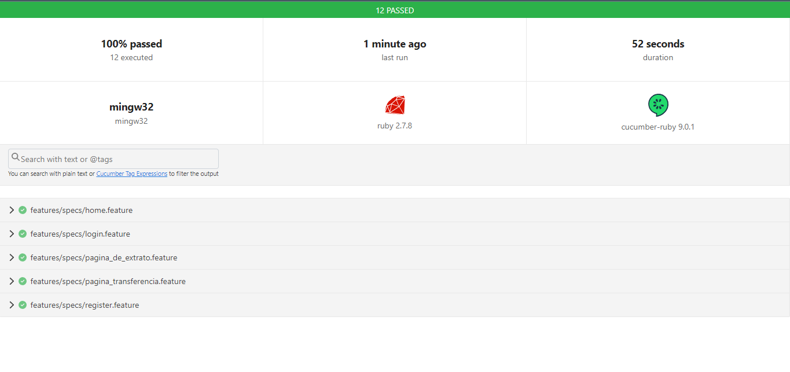

# Sprint Final




> Nesta sprint, concentramos nosssos esforços em aprimorar a qualidade e a eficiência do projeto BugBank, um site voltado para que a comunidade possa aprimorar suas habilidades em automatização de testes. Além disso foi realizados muitas outras etapas essenciais na vida profissional de um testador, como podemos ver abaixo.

## Plano de Teste

Uma das etapas cruciais desta sprint foi a criação de um plano de teste abrangente. Este plano detalhado delineou as estratégias, cenários e casos de teste necessários para garantir que o BugBank funcione perfeitamente.

## Mapa Mental

Para manter uma visão clara de todos os aspectos do projeto, desenvolvemos um mapa mental abrangente. Esse mapa ajudou a visualizar a estrutura e as diferentes partes do BugBank, permitindo-nos tomar decisões informadas sobre o mode de testar o site.

## Board de Issues

Utilizamos um board de issues para gerenciar as tarefas e problemas relacionados ao projeto. Esta ferramenta nos permitiu priorizar e rastrear todas as atividades da sprint, garantindo que nada fosse esquecido.

## Automação de Testes

A automação de testes desempenhou um papel fundamental nesta sprint. Implementamos um conjunto de testes automatizados que economizarão tempo e recursos a longo prazo, permitindo-nos identificar rapidamente qualquer regressão ou erro no BugBank. Isso nos ajudará a manter a qualidade do software à medida que o projeto cresce.


## 👨‍💻 Tecnologias Utilizadas

* Ruby
* Cucumber
* Capybara
* Selenium-webdriver
* Site Prism
* RSpec


## 💻 Pré-requisitos

Antes de começar é importante saber que esse peojeto foi desenvolvido no sistema operacinial Windows e para outros sistemas os comandos podem mudar. Verifique se você atendeu aos seguintes requisitos:

* Instalar o  `<Ruby>`
* Intalar a versão mais recente do `<Cmder>`.
* Possuir `<VsCode com plugins- Cucumber- Cucumber(Gherkin)- Gherkin Indent- Ruby- Snippets and Syntax Hihglight -- VSCode Ruby >`.

## 🚀 Instalando <Automação_Testes>

Para instalar o <Automação_Testes>, siga estas etapas:
* Realizar Fork do repositório
* No Cmder, entrar na pasta Automação_Testes
* E executar o comando abaixo:

    

Windows:
```
<bundle install>
```

## ☕ Usando oprejeto <Automação_Testes>

Para usar <Automação_Testes>, siga estas etapas:

```
<bundle exec cucumber -p default -t@search_for_product --publish>
```


## 🤝 Autor

Iura Kurtz Filho


